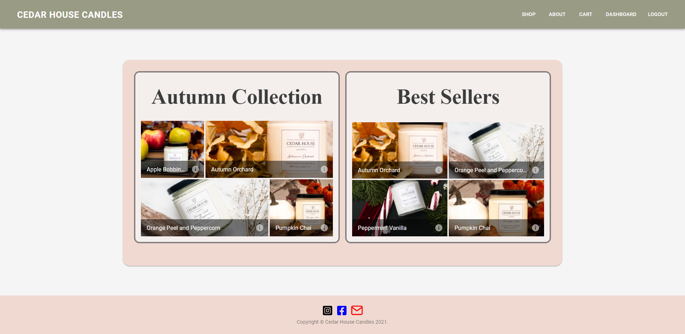

# Cedar House Candles

## Description

A small full stack ecommerce website that is performance optimize, can scale up, single page website, secure, and easy for the client to maintain without developer help .

---

## Table of Contents

-   [Installation Instructions](#installation-instructions)
-   [Usage Information](#usage-information)
-   [License](#license)
-   [Contribution Guidelines](#contribution-guidelines)
-   [Test Instructions](#test-instructions)
-   [Questions](#questions)

---

## Installation Instructions

This app will be deployed to heroku where it is fully functional without any installation. If you want to download the app locally you will need to run npm install in the root directory to install all dependencies for the project. The app also features a seeder that can be utilized by running npm run data:destroy to destroy all data in the database and npm run data:import to seed the database with the product and user seeds.

---

## Usage Information

The front page will present the user with the current collection and best sellers. Clicking on the the information icon in the bottom left of each image presents the user with a detailed product page with more information. The user can then add the product to the cart or select shop in the navigation to take them to view all products available. Once all desired products are in the cart the user can proceed with the checkout process. The user will be prompted to login if not currently authenticated when proceeding to checkout detailing the features of being logged in. The user will then proceed through the checkout process and cart review to place an order. Once place order is selected the order is now in a state to proceed with payment for the order to be completed. When the order has been paid it will take the user to a thank you for your order screen. If logged in when ordering the user will have order history on the dashboard and will be able to complete the purchase through an order detail page if returning to an unpaid order.

Deployed Link: https://cedar-house-candles-project.herokuapp.com/

---

## License

This project is not utilizing a license

---

## Contribution Guidelines

This project is fully open source, any pull requests for improvements will be reviewed.

---

## Test Instructions

This app does not utilize tests

---

## Questions

If there are further questions please contact me with the following.

 AndrewMorrow- <a href="https://github.com/AndrewMorrow" target= "_blank">Github</a>
 SantiagoHR2020- <a href="https://github.com/SantiagoHR2020" target= "_blank">Github</a>

Email: beardedmongo@gmail.com, shincapie81@gmail.com
